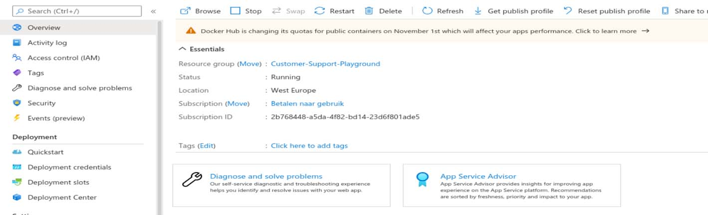

How to Deploy 1password connect server on azure app service using Docker

<!--more-->
## Solution Overview

I just did some experimenting with deploying to Azure Web App for Containers. And there are indeed a few caveats.
    
### Walkthrough


1. Create a Web App for the following `docker-compose.yml` (you can change the compose file for an existing app in Deployment Center):

```DOCKER version: '3.4'
services:
  op-connect-api:
    image: '1password/connect-api:latest'
    ports:
      - '8080:8080'
    volumes:
      - ${WEBAPP_STORAGE_HOME}/op/1password-credentials.json:/home/opuser/.op/1password-credentials.json
      - 'data:/home/opuser/.op/data'
  op-connect-sync:
    image: '1password/connect-sync:latest'
    ports:
      - '8081:8080'
    volumes:
      - ${WEBAPP_STORAGE_HOME}/op/1password-credentials.json:/home/opuser/.op/1password-credentials.json
      - 'data:/home/opuser/.op/data'
volumes:
  data:
```

2. Go to the details of the App Service. This should look something like this:
   


3. In Configuration, change WEBSITES_ENABLE_APP_SERVICE_STORAGE to true (or create it if it does not yet exist).
   
4. Upload the 1password-credentials.json to the op/ directory by using the credentials displayed in Deployment Center -> FTP Credentials. ***:exclamation: Note : op dir should be created in /site/wwwroot***
   
5. Go to Overview and click Restart.
   
6. Make a request to the app with a valid token (looking at the original post, it seems like you already got that right).


For me, this resulted in a working Connect instance. Let me know if it also works for you. Some steps were a somewhat concise, don't hesitate to ask for more details if that helps.:smile:
