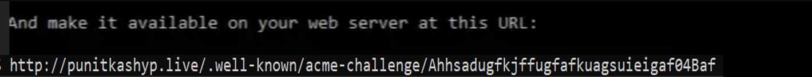

How to Enable SSL to Azure Web App using LetsEncrypt.

<!--more-->
## Solution Overview

If you’re interested in adding SSL / HTTPS to your Azure Web App you can buy a certificate within Azure, but if you use LetsEncrypt you can add SSL for free (downside: renew your certificate every 3 months)


## Prerequisites

1. Ubuntu (I used the Ubuntu app on my Windows Machine)
2. An Azure Web App running on a App Service (platform: Windows, minimal plan supporting SSL: Basic)
    
## Walkthrough

##### Step 1: Install Certbot & OpenSSL

The tools you need to create the certificate with LetsEncrypt and convert it to a format Azure accepts are

* Certbot: Sets up the challenge with LetsEncrypt to verify your domain
* OpenSSL: Converts the certificates created by Certbot to a format that Azure accepts (PFX)

I’ve installed these tools in the [Ubuntu](https://www.microsoft.com/en-us/p/ubuntu/9nblggh4msv6) app on my Windows Machine using the following commands:

```Bash sudo apt-get install software-properties-common 
sudo add-apt-repository ppa:certbot/certbot
sudo apt-get install certbot 
sudo apt-get install openssl
```

#### Step 2: Setup a challenge with LetsEncrypt

Now we’ve installed Certbot we can tell it to setup a challenge with the LetsEncrypt servers to verify you’re the owner of the domain. In this example I will use the HTTP challenge.

`sudo certbot certonly --preferred-challenges http -d punitkashyup.live --manual`

We use the flag manual to indicate we’re doing this on behalf of a different server, since we’re not running this command from web server itself (Azure doesn’t allow this).

**Note:** you should replace punitkashyup.live with your own domain.

**Please note that these steps will generate the certificate for the exact domain you enter. It matters if you enter www.yourdomain.com or yourdomain.com! If you want both, complete the steps twice.**


You’ll see instructions on your screen on what file and contents you should create.

Create the file and use the .txt extension . Why? You’ll see in the next step.


#### Step 3: Upload the challenge file to your Azure Web App

So now you have a .txt file with the contents that you were supposed to add. You upload this file into a directory on your app service plan. Upload it any way you like (I used FTP).

Since I have a .NET core application I had to upload into the wwwroot folder in the wwwroot of my Azure website. This is the folder for your static files in .NET core.

Check if you can access the file in your browser by going to the full url with the .txt extension.


#### Step 4: For windows Modify your web.config to rewrite the challenge file without extension

As you can see in the instructions in Step 1. The servers of LetsEncrypt will visit your challenge file without the .txt extension. By default this isn’t supported by .NET / IIS and that’s why we add an IIS rewrite rule to redirect the url LetsEncrypt checks to the .txt file we’ve uploaded.


```CONFIG 
<?xml version="1.0" encoding="utf-8"?>
<configuration>
<system.webServer>
<handlers>
<add name="aspNetCore" path="*" verb="*" modules="AspNetCoreModule" resourceType="Unspecified" />
</handlers>
<aspNetCore processPath="dotnet" arguments=".\OMT.Web.dll" stdoutLogEnabled="false" stdoutLogFile=".\logs\stdout" />
<rewrite> 
<rules> 
<rule name="wildcard"> 
<match url=".*well-known/acme-challenge/(?!.*?\.txt$)(.*)$" /> 
<action type="Redirect" url="/.well-known/acme-challenge/{R:1}.txt" /> 
</rule> 
</rules> 
</rewrite> 
</system.webServer>
</configuration>
```


Now you should be able to visit the exact url:  





#### Step 5: Convert the certificate to PFX using OpenSSL


When you’ve done this you can convert the certificates using the following command.

``sudo openssl pkcs12 -export -in /etc/letsencrypt/live/punitkashyup.live/fullchain.pem -inkey /etc/letsencrypt/live/punitkashyup.live/privkey.pem -out punitkashyup.live.pfx``

It will ask you for a password (remember this) and will generate a .pfx file you can upload into the Azure portal.


If you want to copy the PFX file from your Windows Ubuntu app to your Windows Environment you can use the following folder


``%userprofile%\AppData\Local\Packages``

Search for the CanonicalGroupLimited.UbuntuonWindows folder and navigate to the following path in that folder.

``%userprofile%\AppData\Local\Packages\CanonicalGroupLimited.UbuntuonWindows_(YOUR_POSTFIX)\LocalState\rootfs\etc\letsencrypt\live\ourmixtape.net``

There you’ll find the generated PFX file. Copy it to somewhere convenient.

#### Step 6: Upload your PFX certificate into the Azure Portal and add the SSL binding


Go to the SSL settings of your web app and press ‘upload certificate’

Upload your .pfx file and enter the password you remembered from Step 4.

Add the SSL binding to the uploaded certificate
Wait a few minutes and visit your website using https and you’ll see that it’s served with the LetsEncrypt certificate.

**Remember to do these steps for each subdomain** Peace :v: