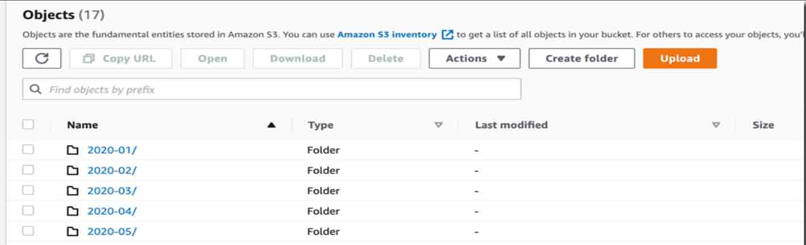

In this blog we will use shell script to backup a website or any file to Amazon S3 bucket with cron job

<!--more-->
## Table of contents
The following steps provide a high-level overview of the walkthrough:
1. Creating an S3 Bucket
2. Setting Up an IAM role for S3
3. Install AWS CLI
4. Config S3 for backup
5. Backup files and folders to Amazon S3 (Shell script)
6. How to run the backup script?
7. Run the backup script every day or weekly
8. Backup files on Amazon S3

### Creating an S3 Bucket
First, we’ll need to create a new S3 bucket to hold our backups.

### Setting Up an IAM role for S3
Log in to the AWS Console and navigate to Services => S3. Click the Create bucket button, give the bucket a name and select a region. You’ll need to remember the region for a later step. You can leave the rest of the settings as their defaults.

### Configuring Site Backups
To set up backups for a site, first, create a new ``backups`` directory in the site’s root directory. 
This will store all your backup files.


### Setting Up an AWS User
Navigate to IAM users and create a user
Assign the AmazonS3 access permissions
Copy your Access Key ID and Secret Access Key


Be sure to hang onto your Access Keys as you will need them later.


### Installing AWS CLI
Amazon offers an official set of command line tools for working with all its services including S3. They also provide detailed installation instructions.
[Follow this](https://docs.aws.amazon.com/cli/latest/userguide/getting-started-install.html)


``$ aws --version
aws-cli/1.17.0 Python/2.7.16 Linux/4.x-amd64 botocore/1.14.0``

### Config S3 for backup

To upload to S3, we first need to configure the AWS CLI with the Access Keys of the user we created earlier, by running the aws configure command. Set the default region to the same region you chose for the S3 bucket and leave the default output format.

``aws configure``


Just provied your IAM credentials on as per step .

You can see your configured credentials by `aws configure list` .

```Bash
AWS Access Key ID [None]: **************
AWS Secret Access Key [None]: ***************************
Default region name [None]: us-west-2
Default output format [None]:
```

**Note:** If you want to configure IAM credentials for other then `root` user then run below command.

``sudo -H -u <username> aws configure``

### Configuring Site Backups


`cd /home/punit/`


`mkdir backups`


### Writing the script
we’ll create a new shell script called ``backup.sh.``


``nano backup.sh``

Paste the following contents into the file.
Below is a shell script to backup the specified files and folders and gzip it into a folder, later we can use the aws command to upload the gzip backup file to the Amazon S3.

```BASH 
#!/bin/bash

################################################################
##
##   Site Backup To Amazon S3
##   Written By: Punit
##   https://punitkashyup.live/linux/how-to-zip-unzip-tar-in-unix-linux/
##   https://docs.aws.amazon.com/cli/latest/userguide/install-linux.html
##
##   $crontab -e
##   Weekly website backup, at 01:30 on Sunday
##   30 1 * * 0 /home/punit/script/backup-site.sh > /dev/null 2>&1
################################################################

NOW=$(date +"%Y-%m-%d")
NOW_TIME=$(date +"%Y-%m-%d %T %p")
NOW_MONTH=$(date +"%Y-%m")

BACKUP_DIR="/home/punit/backup/$NOW_MONTH"
BACKUP_FILENAME="site-$NOW.tar.gz"
BACKUP_FULL_PATH="$BACKUP_DIR/$BACKUP_FILENAME"

AMAZON_S3_BUCKET="s3://punit/backup/site/$NOW_MONTH/"
AMAZON_S3_BIN="/home/punit/.local/bin/aws"

# put the files and folder path here for backup
CONF_FOLDERS_TO_BACKUP=("/etc/nginx/nginx.conf" "/etc/nginx/conf.d" "/path.to/file" "/path.to/folder")
SITE_FOLDERS_TO_BACKUP=("/var/www/wordpress/" "/var/www/others")

#################################################################

mkdir -p ${BACKUP_DIR}

backup_files(){
        tar -czf ${BACKUP_DIR}/${BACKUP_FILENAME} ${CONF_FOLDERS_TO_BACKUP[@]} ${SITE_FOLDERS_TO_BACKUP[@]}
}

upload_s3(){
        ${AMAZON_S3_BIN} s3 cp ${BACKUP_FULL_PATH} ${AMAZON_S3_BUCKET}
}

backup_files
upload_s3

# this is optional, we use mailgun to send email for the status update
if [ $? -eq 0 ]; then
        # if success, send out an email
        curl -s --user "api:key..." \
                https://api.mailgun.net/v3/punitkashyup.live/messages \
                -F from="backup job <backup@punitkashyup.live>" \
                -F to=user@yourdomain.com \
                -F subject="Backup Successful (Site) - $NOW" \
                -F text="File $BACKUP_FULL_PATH is backup to $AMAZON_S3_BUCKET, time:$NOW_TIME"
else
        # if failed, send out an email
        curl -s --user "api:key..." \
                https://api.mailgun.net/v3/punitkashyup.live/messages \
                -F from="backup job <backup@yourdomain.com>" \
                -F to=user@yourdomain.com \
                -F subject="Backup Failed! (Site) - $NOW" \
                -F text="Unable to backup!? Please check the server log!"
fi;

#if [ $? -eq 0 ]; then
#  echo "Backup is done! ${NOW_TIME}" | mail -s "Backup Successful (Site) - ${NOW}" -r cron admin@punitkashyup.live
#else
#  echo "Backup is failed! ${NOW_TIME}" | mail -s "Backup Failed (Site) ${NOW}" -r cron admin@punitkashyup.live
#fi;

```

### How to run the backup script?
We must assign a +x execute permission to run the shell script.


`chmod +x backup-site.sh`

**Run the backup** 

`./backup-site.sh`

### Run the backup script every day or weekly
The last step is to schedule the backup script to run at a designated time. Begin by opening the crontab for the current user.


`crontab -e`

**Daily, 1:00am**
`0 1 * * * /home/mkyong/script/backup-site.sh > /dev/null 2>&1`

**Weekly, 1:30am**
`30 1 * * 0 /home/mkyong/script/backup-site.sh > /dev/null 2>&1`


### Cleaning Up Old Backups
Over time, this backup process is going to create a bunch of folder and file archives in the backups directory, which can be a common reason for running out of server disk space.

To remove old backups, add a line to the bottom of the backups.sh script.

### Remove backup files that are a month old


``rm -f /home/punit/backup/$(date +%Y%m%d* --date='1 month ago').gz``

## Conclusion

### Result



So there you have it, a fairly straightforward setup to backup your site of any file or folder and store it in S3.
You can also enable versioning on the bucket so that all your files are restorable in case of accidental deletion.