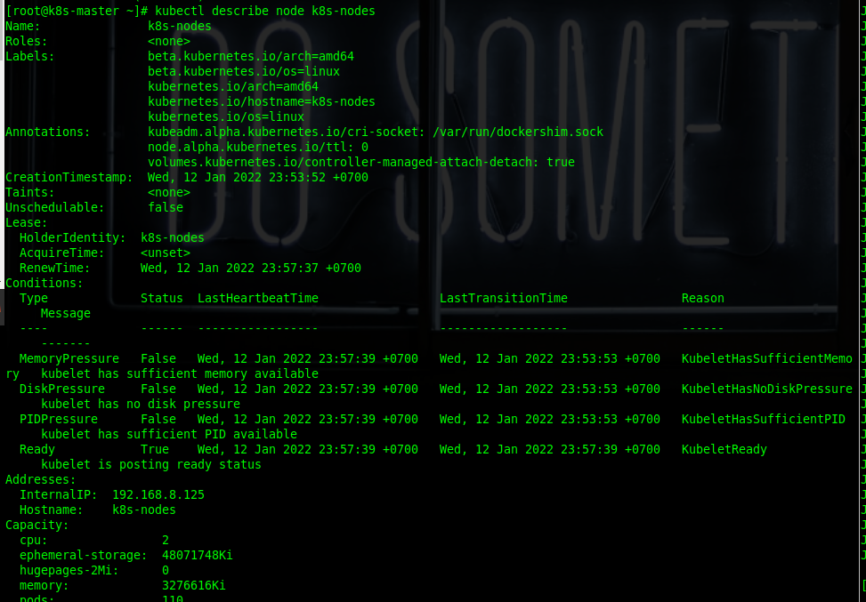
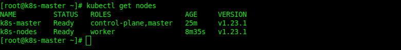

Setup a kubernetes multi-node cluster from scratch and run a simple app on it.

<!--more-->
## Overview
Kubernetes is a Linux based open source platform that automates or manages applications in containers. With Kubernetes, you can efficiently respond to the requests by consumers by using Kubernetes nodes.

Kubernetes is in a thriving ecosystem. Kubernetes services, support, and tools are widely available– as quoted on the Kubernetes website.

For installation, you must provide an operating system with special specifications. You can also use Kubernetes on-premise, for example, on GCP, AWS, and DigitalOcean.

## Installing Kubernetes on Linux

For the installation of Kubernetes, I used CentOS 7 with two nodes connected. In the first step, you will enter your CentOS 7 servers. I used 2 CentOS 7 operating systems for the Master and Kubernetes nodes. But first, let’s change the hostnames of CentOS master and worker node.

``[root@localhost ~]# hostnamectl set-hostname k8s-master``

Then change the hostname on CentOS 7 worker nodes.

``[root@localhost ~]# hostnamectl set-hostname k8s-nodes``

After that, we add the hostname and IP address to the master and Kubernetes nodes so they can be connected the /etc/hosts file.

Before doing so, add on the CentOS 7 master node.

``[root@localhost ~]# nano /etc/hosts``

Then add the hostname and IP address of the master and worker nodes on the CentOS 7 worker node as well with this command:

``[root@localhost ~]# nano /etc/hosts``


If SELinux on CentOS 7 is still enforcing, then we need to turn off SELinux on CentOS 7 master and worker nodes.

```Bash
[root@localhost ~]# setenforce 0
[root@localhost ~]# sed -i --follow-symlinks 's/SELINUX=enforcing/SELINUX=disabled/g' /etc/sysconfig/selinux
```
Then we configure for networking so that IPTables can forward it. We can run the below command on the CentOS 7 master and worker nodes.

```Bash
[root@localhost ~]# modprobe br_netfilter
[root@localhost ~]# echo '1' > /proc/sys/net/bridge/bridge-nf-call-iptables
```

Another key prerequisite for installation of Kubernetes on CentOS 7 or linux is to turn off swap. Our first step is to disable it with the command below, we will do it first on the centos 7 master node.

``[root@localhost ~]# swapoff -a``


To enable permanent, we must put a hash (#) for swap in the /etc/fstab file. We will do this first on the CentOS 7 master node.

``[root@localhost ~]# nano /etc/fstab``

Next we will disable swap on the CentOS 7 worker node using the command below.

``[root@localhost ~]# swapoff -a``

We will disable permanent swap in the /etc/fstab file, just like on the CentOS 7 master node on the worker node.

Now, we will reboot both the master and worker nodes using the commands below.

``[root@localhost ~]# reboot``

## Kubernetes Container: Dependencies

Before we install Docker and the Kubernetes tools, we have to install some packages on the master and worker nodes. In the following part of this post, we will install the package on the CentOS 7 master and worker nodes.

``[root@k8s-master ~]# yum install yum-utils device-mapper-persistent-data lvm2 -y``

After the package is installed on the master and worker, we will add the docker repository on the CentOS 7 master and worker nodes

``[root@k8s-master ~]# yum-config-manager --add-repo https://download.docker.com/linux/centos/docker-ce.repo``

Then we will install docker-ce on the master and worker nodes, for the first we will install on the CentOS 7 master node and worker nodes.

``[root@k8s-master ~]# yum install docker-ce -y``

Wait for until docker-ce has been successfully installed on both master and worker nodes. Enable and start docker-ce so that docker can continue when you reboot the server.

``[root@k8s-master ~]# systemctl enable docker && systemctl start docker``

## Kubernetes Nodes: Installation of Kubernetes Tools

To be able to use kubernetes on CentOS 7, the first step we have to add the kubernetes repository on CentOS 7. For that, add the Kubernetes repository on the CentOS 7 master and worker nodes.

```Bash
[root@k8s-master ~]# cat <<EOF > /etc/yum.repos.d/kubernetes.repo
[kubernetes]
name=Kubernetes
baseurl=https://packages.cloud.google.com/yum/repos/kubernetes-el7-x86_64
enabled=1
gpgcheck=1
repo_gpgcheck=1
gpgkey=https://packages.cloud.google.com/yum/doc/yum-key.gpg
       https://packages.cloud.google.com/yum/doc/rpm-package-key.gpg
EOF
```
You have successfully added the Kubernetes repository to the master and worker nodes now.

After that, you will have to install Kubernetes and its tools on the CentOS 7 master and worker nodes.

``[root@k8s-master ~]# yum install kubelet kubeadm kubectl -y``

After the installation processes on the master and worker nodes complete, activate and enable Kubernetes so that it can run properly. But first, activate it on the CentOS 7 master node.

``[root@k8s-master ~]# systemctl enable kubelet && systemctl start kubelet``

Then, enable and activate Kubernetes on the CentOS 7 worker node.

``[root@k8s-nodes ~]# systemctl enable kubelet && systemctl start kubelet``

In the next step, equate the cgroup driver of docker and Kubernetes. The first step you must check is the cgroup driver on docker using this command on the master node CentOS 7.

``[root@k8s-master ~]# docker info | grep -i 'cgroup driver'``

Then, add the cgroup driver that was found into the /etc/sysconfig/kubelet file on the CentOS 7 master and worker nodes.

``[root@k8s-master ~]# vi /etc/sysconfig/kubelet``

## Setup Kubernetes Nodes

If you have set up the cgroup, you will create an init network with kubeadm on the CentOS 7 master node.

``[root@k8s-master ~]# kubeadm init --pod-network-cidr=10.244.0.0/16``

Run this command so that that Kubernetes runs properly.

```Bash
[root@k8s-master ~]# mkdir -p $HOME/.kube
[root@k8s-master ~]# sudo cp -i /etc/kubernetes/admin.conf $HOME/.kube/config
[root@k8s-master ~]# sudo chown $(id -u):$(id -g) $HOME/.kube/config
```
Then you may run the command below to see if the node is running properly or not.

``[root@k8s-master ~]# kubectl get nodes``


To make nodes ready, you have to add add pods i.e. weave-net. Add it with this command:

```Bash
[root@k8s-master ~]# kubectl apply -f "https://cloud.weave.works/k8s/net?k8s-version=$(kubectl version | base64 | tr -d '\n')" 
```
Check again the Kubernetes node; maybe you need to wait a while for the node to be ready.

``[root@k8s-master ~]# kubectl get nodes``

When the node is ready, combine the master and worker nodes with the tokens created from the previous kubeadm init.

```Bash
[root@k8s-master ~]# kubeadm join 192.168.8.124:6443 --token opd50x.ohi8hq7jsmu76r3o \
	--discovery-token-ca-cert-hash sha256:9ee1755bb2fb50db2d4a5c6f18f480360682de1e2405b2d5a3ef1a3078a6cede
```


Once the master node is joined to the worker node, you need to describe the worker node so it can be ready on the master node.




After that, you can use this command to see if both nodes are ready to use.

``[root@k8s-master ~]# kubectl get nodes``

We have seen that the node is ready, so the next step will be to create a label for the worker node role with the command below.

``[root@k8s-master ~]# kubectl label node k8s-nodes node-role.kubernetes.io/worker=worker``

Then, check the nodes again. You will see that the roles on the worker node have changed.



That's all folks Peace :v: