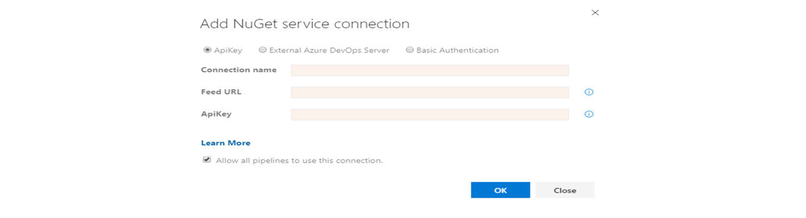

This will be a quick article on various ways to do private nuget package restore i.e restore your applications’s nuget packages from private nuget feed. This will be applicable for both nuget.org private feed or private nuget feed of Azure DevOps artifacts.

<!--more-->
## Nuget
NuGet is the package manager for .NET. The NuGet client tools provide the ability to produce and consume packages. The NuGet Gallery is the central package repository used by all package authors and consumers.
[Nuget.org](https://www.nuget.org/)

## Azure devops Pipeline
In case you are using Azure devops to build your application, if build server is capable of doing msbuild or dotnetcore build, there is always option to restore the package from the devops pipeline. The restore nuget task in azure devops has the ability to pass credential to authenticate the private feed in a secured manner using build secrets. This is the easiest and secure way to restore your project’s nuget packages from your build pipeline.


If you see the image above this is the nuget task from azure devops. For private feeds there is the Feeds and authentication section which provides the option to select any private feed that is with in the DevOps organisation, easy peasy, right?

### Authenticating feeds outside the organisation
Now what about authenticating feeds outside the organisation? Which might also include packages from private nuget.org feeds. For external feeds we can add service connection to those external feeds from devops service connections.



Once the service connection is created you can use the nuget credential task of vsts to insert the credential into the pipeline.
#### Please find the official documentation of nuget tasks:
**[NuGet restore, pack, and publish task - Azure Pipelines](https://docs.microsoft.com/en-us/azure/devops/pipelines/tasks/package/nuget?view=azure-devops)**\
**[NuGet Authenticate - Azure Pipelines](https://docs.microsoft.com/en-us/azure/devops/pipelines/tasks/package/nuget-authenticate?view=azure-devops)**

However there might be cases, where you might need to restore the packages from your docker build, which was the case for my project.

## In Docker
In case you are doing the whole build activity from with in the docker build i.e in the dockerfile itself. In that case you need to pass the credential inside the docker build deamon somehow to perform the nuget restore from the private nuget feed(s). Obviously its not secure to store the credentials for private nuget feed in nuget.config in source control. So we need to have some kind of mechanism to pass the credentials during the build in a secure manner.


Now lets look at the options available to achieve that:

1. **Using Build ARG + ENV variables to pass PAT token from build pipeline to docker.**
2. **Use more secure feature of docker build i.e docker build secrets to pass PAT token from build pipeline to docker.**


Lets look at each options in details.

1. So there is a way in docker build to pass the PAT token to access private nuget feed from azure build pipeline to docker build deamon. We can use docker ARG and docker ENV variables to achieve this. Let’s see how!
This become possible with the introduction of nuget credential provider by Microsoft. Which is available in the link below:

```Docker
ARG PAT
# Install the nuget credential provider
RUN apt-get update && apt-get install -y locales \
&& sed -i -e ‘s/# en_US.UTF-8 UTF-8/en_US.UTF-8 UTF-8/’ /etc/locale.gen \
&& dpkg-reconfigure — frontend=noninteractive locales && update-locale LANG=en_US.UTF-8 

# Download the artifact credential provider
&& wget -qO- https://raw.githubusercontent.com/Microsoft/artifacts-credprovider/master/helpers/installcredprovider.sh | bash

# Copy the nuget.config that has the package source for the private store. Make sure the secrets are not included here. Also your project normal copy activities, for simplicity I have shown COPY ALL.
COPY . ./
#In this example I just copies all content but you can actually copy only the nuget.config file if required.

# Use the secret to set the credential provider variable and run restore.
RUN export ENV VSS_NUGET_EXTERNAL_FEED_ENDPOINTS=”{\”endpointCredentials\”: [{\”endpoint\”:\”https://<URL of your private feed>/nuget/v3/index.json\", \”username\”:\”build\”, \”password\”:\”${PAT}\”}]}” \
&& dotnet restore \
&& unset VSS_NUGET_EXTERNAL_FEED_ENDPOINTS
```

In order to build this image make sure you pass the Access Token in PAT as build argument. In Azure DevOps System.AccessToken is a prefedined variable [which stores the access token for the logged in user to call the VSTS APIs](https://docs.microsoft.com/en-us/azure/devops/pipelines/build/variables?view=azure-devops&tabs=yaml).

```markdown docker build --build-arg PAT=$(System.AccessToken)```

Note: If you are using multi staged build in Docker you might be able to restrict the use of PAT in only one layer so that it is not available as the final docker image.

2. For the more secure option using docker build secrets, it uses an experimental docker syntax which comes with docker 18.09 where docker build comes with buildkit.

In Docker 18.09, Docker build secrets were added via buildkit. Basically, you are able to mount a volume at build time that is inaccessible after the image is built. Please refer to this existing article below for more details on docker buildkit and how to use this in conjunction with artifact credential provider.

[Using Nuget Restore securely inside of Docker Containers with caching](https://medium.com/@cwoolum/using-nuget-restore-securely-inside-of-docker-containers-with-caching-2c2f5453905d)

Here is sample dockerfile which is used for this demo:

```Docker
# Install the nuget credential provider
RUN apt-get update && apt-get install -y locales \   && sed -i -e 's/# en_US.UTF-8 UTF-8/en_US.UTF-8 UTF-8/' /etc/locale.gen \   && dpkg-reconfigure --frontend=noninteractive locales && update-locale LANG=en_US.UTF-8 \

# Download the artifact credential provider  
&& wget -qO- https://raw.githubusercontent.com/Microsoft/artifacts-credprovider/master/helpers/installcredprovider.sh | bash

# Copy the nuget.config that has the package source for the private store. Make sure the secrets are not included here.
COPY Nuget.config
COPY ["MyWebApp.csproj", "./"]

# Use the secret to set the credential provider variable and run restore.
RUN --mount=type=secret,id=pat,dst=/pat export VSS_NUGET_EXTERNAL_FEED_ENDPOINTS="{\"endpointCredentials\": [{\"endpoint\":\"https://<URL of private feed>/nuget/v3/index.json\", \"username\":\"build\", \"password\":\"`cat /pat`\"}]}"
&& \ dotnet restore "MyWebApp.csproj" --configfile Nuget.config
&& \  unset VSS_NUGET_EXTERNAL_FEED_ENDPOINTS
COPY . .
```

While building the image we have to pass the PAT token to the secret like below:

```export DOCKER_BUILDKIT=1```

```echo $(System.AccessToken) >> pat```


```docker build --secret id=pat,src=./pat .```

As you can see both option 1 and option 2 are basically using the same concept of using the PAT token and the credential provider to connect to the private feed and once restore operation is done we unset the variables so that it can no longer be used in other layers of the docker build.

Hope you liked this blog. Please let me know in comments if you have any suggestions or any other approach for accessing private nuget feed from docker build.


