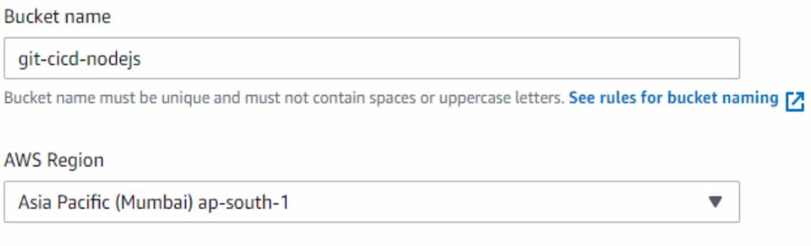
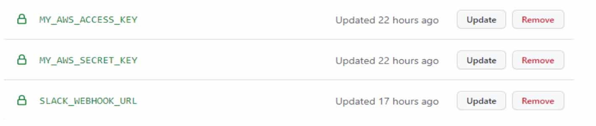
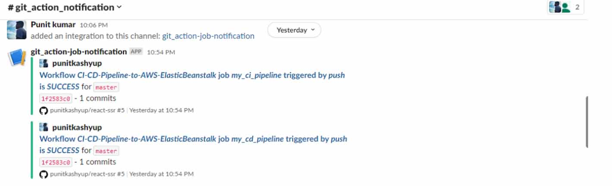
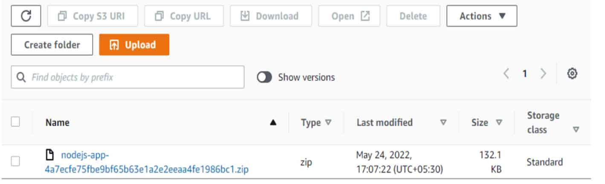
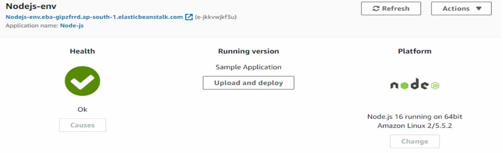

How to Deploy react application using GitHub Actions and AWS and Notification will be on Slack

<!--more-->
## Solution Overview

1. GitHub Actions: Workflow Orchestration tool that will host the Pipeline.
2. IAM OIDC identity provider: Federated authentication service to establish trust 
   between GitHub and AWS to allow GitHub Actions to deploy on AWS without 
   maintaining AWS Secrets and credentials
3. Amazon S3: Amazon S3 to store the deployment artifacts.
4. AWS Elastic Beanstalk: AWS Elastic Beanstalk is an easy-to-use service for deploying 
   and scaling web applications and services developed with Java, .NET, PHP, Node.js, 
   Python, Ruby, Go, and Docker on familiar servers such as Apache, Nginx, Passenger, and IIS.
5. Slack: Setting Up Slack Notification after All check are passed or Failed CI/CD Process.

## Prerequisites

1. An AWS account with permissions to create the necessary resources.
2. A Git Client clone the provided source code. In our case we are using creating a 
  fork from following link ( https://github.com/alexnm/react-ssr ). A baseline for 
  server-side rendering React application
3. A GitHub Account with permissions to configure GitHub repositories, create 
   workflows, and configure GitHub secrets.
4. A Slack Account with permissions to configure Slack Notification with help of 
   Slack webhook.

## Walkthrough
The following steps provide a high-level overview of the walkthrough:
1. Fork the project from the provided git project link.
2. Creating an IAM Role with a full access of S3 & Beanstalk.
3. Creating S3 Bucket to store Source Code.
4. Setting our Elastic Beanstalk environment.
5. Setting Up Slack Webhook.
6. Setup GitHub secrets.
7. Build CI/CD Pipeline in GitHub Action to build and deploy the code.
8. Trigger the GitHub Action to build and deploy the code.
9. Verify the deployment.
10. Clean up: To avoid incurring future changes, you should clean up the resources that you created.
    
### Fork the source code
Browse to a [project](https://github.com/alexnm/react-ssr ) repository for fork. At the top right of the page, you will find the 
Fork button. Click on the button and wait for a few seconds. You will see that the newly 
forked repository gets created under your GitHub account.

### Creating an IAM Role with a full access of S3 & Beanstalk.
Now, Creating an IAM role user name will be github-actions with full permission S3 & 
Beanstalk
After creating IAM role save credentials (Access key ID, Secret access key) in notepad we 
will going to use it as authentication in between AWS & GitHub


### Creating S3 Bucket to store Source Code.


### Setting our Elastic Beanstalk environment.
Now Creating a Elastic Beanstalk environment platform going to Nodejs version as per 
your requirement in our case we will going to use latest version. Application name will 
be Node-js

### Setting Up Slack Webhook
To get Slack notification on job status we need to configure two things First need to 
create webhook URL.
Create Incoming Webhook URL on slack. Incoming webhooks are a simple way to post 
messages from external sources into Slack. You will get the below page at the end 
where you will find the Webhook URL.
Save the Slack Webhook URL in your github secrets. Settings->Secrets under the name 
SLACK_WEBHOOK_URL.
Now later we need to Setup Job in Github Actions Workflow

### Setup GitHub secrets
As we save Slack Webhook URL in our github secrets. Settings->Secrets under the name 
SLACK_WEBHOOK_URL.
Now, also we need to save our AWS credentials (Access key ID, Secret access key) in 
github secrets. Settings->Secrets under the name MY_AWS_ACCESS_KEY as well as 
MY_AWS_SECRET_KEY


### Build CI/CD Pipeline in GitHub Action to build and deploy the code
Now for creating CI/CD Pipeline in GitHub Action firstly we need to setup a workflow by 
our self as per shown in image Let's create our first workflow that will contain our build and test jobs. We do that by 
creating a file with a .yml extension. Let's name this file main.yml
Add the content below in the yaml file you just created:

```YML
#---------------------------------------------------------------------
# GitHub Action Workflow to Deploy Nodejs to AWS ElasticBeanstalk
#
# Version Date Info
# 1.0 2022 Initial Version
#
# Made by Punit Kumar Copyright
#---------------------------------------------------------------------
name: CI-CD-Pipeline-to-AWS-ElasticBeanstalk
env:
 SLACK_WEBHOOK_URL : ${{ secrets.SLACK_WEBHOOK_URL }}
 EB_PACKAGE_S3_BUCKET_NAME : "git-cicd-nodejs"
 EB_APPLICATION_NAME : "Node-js"
 EB_ENVIRONMENT_NAME : "Nodejs-env"
 DEPLOY_PACKAGE_NAME : "nodejs-app-${{ github.sha }}.zip"
 AWS_REGION_NAME : "ap-south-1"
on: 
 push:
 branches: 
 - master
jobs:
 my_ci_pipeline:
 runs-on: ubuntu-latest
 
 steps:
 - name: Git clone our repository
 uses: actions/checkout@v1
 
 - name: Create ZIP deployment package
 run : zip -r ${{ env.DEPLOY_PACKAGE_NAME }} ./ -x *.git*
 
 - name: Configure my AWS Credentils
 uses: aws-actions/configure-aws-credentials@v1
 with:
 aws-access-key-id : ${{ secrets.MY_AWS_ACCESS_KEY }}
 aws-secret-access-key: ${{ secrets.MY_AWS_SECRET_KEY }}
 aws-region : ${{ env.AWS_REGION_NAME }}
 - name: Copy our Deployment package to S3 bucket
 run : aws s3 cp ${{ env.DEPLOY_PACKAGE_NAME }} s3://${{ 
env.EB_PACKAGE_S3_BUCKET_NAME}}/
 
 - name: Notify Slack
 uses: act10ns/slack@v1.2.2
 with:
 status: ${{ job.status }}
 steps: ${{ toJson(steps) }}
 channel: '#git_action_notification'
 message: Integration {{ env.GITHUB_REF_NAME }} branch Successfully
 if: always() 
 
 my_cd_pipeline:
 runs-on: ubuntu-latest
 needs: [my_ci_pipeline]
 
 steps:
 - name: Configure my AWS Credentils
 uses: aws-actions/configure-aws-credentials@v1
 with:
 aws-access-key-id : ${{ secrets.MY_AWS_ACCESS_KEY }}
 aws-secret-access-key: ${{ secrets.MY_AWS_SECRET_KEY }}
 aws-region : ${{ env.AWS_REGION_NAME }}
 
 - name: Create new ElasticBeanstalk Applicaiton Version
 run : |
 aws elasticbeanstalk create-application-version \
 --application-name ${{ env.EB_APPLICATION_NAME }} \
 --source-bundle S3Bucket="${{ env.EB_PACKAGE_S3_BUCKET_NAME }}",S3Key="${{ 
env.DEPLOY_PACKAGE_NAME }}" \
 --version-label "Ver-${{ github.sha }}" \
 --description "CommitSHA-${{ github.sha }}"
 - name: Deploy our new Application Version
 run : aws elasticbeanstalk update-environment --environment-name ${{ 
env.EB_ENVIRONMENT_NAME }} --version-label "Ver-${{ github.sha }}"
 
 - name: Notify Slack
 uses: act10ns/slack@v1.2.2
 with:
 status: ${{ job.status }}
 steps: ${{ toJson(steps) }}
 channel: '#git_action_notification'
 message: Deployed {{ env.GITHUB_REF_NAME }} branch Successfully
 if: always()

 ```
### Trigger the GitHub Action to build and deploy the code
Now, After any commit changes in code the workflow automatically going to be trigger 
& job will be start and also we will get slack notification in our channel of CI/CD process.


### Verify the deployment
Code zip successfully uploaded in S3 Bucket


App is sucessfully up runing. And as we deploy our app on Beanstalk so it take care of 
all Health check as well traffic handaling & Sacalibity.


### Clean up
To avoid incurring future charges, you should clean up the resources that you created in Aws ( 
Elastic Bean Stalk,S3 Bucket)