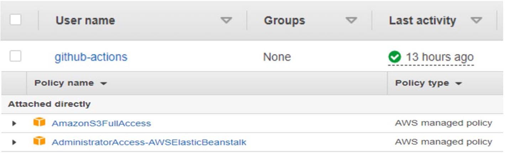

Emoji can be enabled in a Hugo project in a number of ways.

<!--more-->
## Solution Overview

1. GitHub Actions: Workflow Orchestration tool that will host the Pipeline.
2. IAM OIDC identity provider: Federated authentication service to establish trust 
   between GitHub and AWS to allow GitHub Actions to deploy on AWS without 
   maintaining AWS Secrets and credentials
3. Amazon S3: Amazon S3 to store the deployment artifacts.
4. AWS Elastic Beanstalk: AWS Elastic Beanstalk is an easy-to-use service for deploying 
   and scaling web applications and services developed with Java, .NET, PHP, Node.js, 
   Python, Ruby, Go, and Docker on familiar servers such as Apache, Nginx, Passenger, and IIS.
5. Slack: Setting Up Slack Notification after All check are passed or Failed CI/CD Process.

## Prerequisites

1. An AWS account with permissions to create the necessary resources.
2. A Git Client clone the provided source code. In our case we are using creating a 
  fork from following link ( https://github.com/alexnm/react-ssr ). A baseline for 
  server-side rendering React application
3. A GitHub Account with permissions to configure GitHub repositories, create 
   workflows, and configure GitHub secrets.
4. A Slack Account with permissions to configure Slack Notification with help of 
   Slack webhook.

## Walkthrough
The following steps provide a high-level overview of the walkthrough:
1. Fork the project from the provided git project link.
2. Creating an IAM Role with a full access of S3 & Beanstalk.
3. Creating S3 Bucket to store Source Code.
4. Setting our Elastic Beanstalk environment.
5. Setting Up Slack Webhook.
6. Setup GitHub secrets.
7. Build CI/CD Pipeline in GitHub Action to build and deploy the code.
8. Trigger the GitHub Action to build and deploy the code.
9. Verify the deployment.
10. Clean up: To avoid incurring future changes, you should clean up the resources that you created.
    
### Fork the source code
Browse to a [project](https://github.com/alexnm/react-ssr ) repository for fork. At the top right of the page, you will find the 
Fork button. Click on the button and wait for a few seconds. You will see that the newly 
forked repository gets created under your GitHub account.

### Creating an IAM Role with a full access of S3 & Beanstalk.
Now, Creating an IAM role user name will be github-actions with full permission S3 & 
Beanstalk
After creating IAM role save credentials (Access key ID, Secret access key) in notepad we 
will going to use it as authentication in between AWS & GitHub

